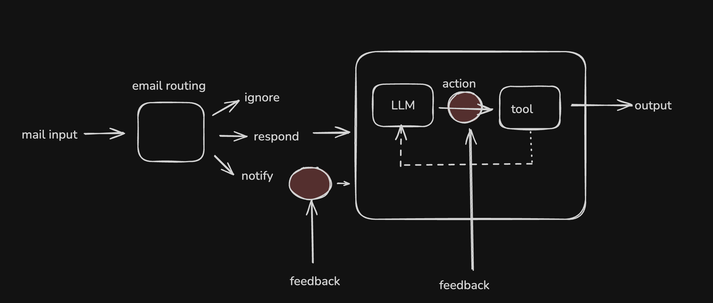
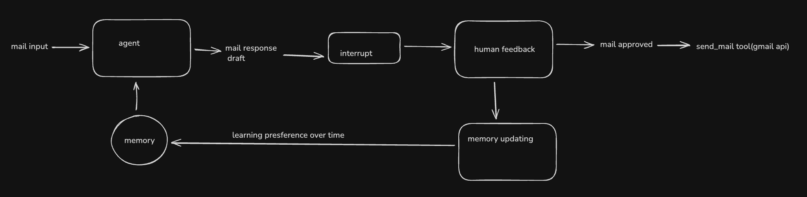

# Gmail Assistant — Backend repo

I created a gmail agent application using langgraph, fastapi, mongodb. It authenticates users via Google OAuth, created a data pipeline from db to fetch emails for the agent and frontend. This agent classifies mails into(Ignore/Respond/Notify) and drafts a replies appropriately with human in the loop method, memory for giving our assistant the ability to remember our HITL feedback (long term memory), persistance checkpointers memory to continue where its stopped for interrupt from human(short term memory).

My agent has 4 nodes include a subagent with 2 nodes and with few conditional edges, normal edges along with 6 tools(fetch_emails, send_email, check_calendar, schedule_meeting, summary, questioning when in doudbt) to select for appropraite tasks. 

check the below ss to know how the feedback loop and memory in the agent is structured.

---
## Tech Stack

- **FastAPI**
- **Gmail API + OAuth 2.0**
- **Langgraph agents (for classification & reply)**
- **Python**

---
## Features
✔ Google OAuth Login  
✔ Fetch Gmail Inbox  
✔ Email Classification (Ignore / Respond / Notify)  
✔ Smart Auto Reply (AI drafts & sends emails)    
✔ Persisted Agent State   
✔ Compose & Send Email API  
✔ Intergrated Gmail API, Google calendar API
---
### Feedback loop

### Long term memory in agent

